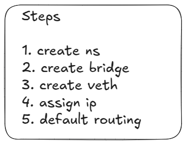
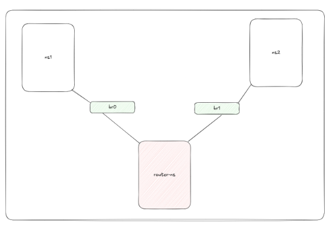
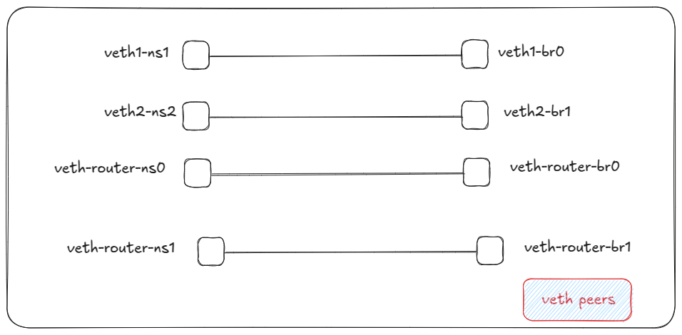
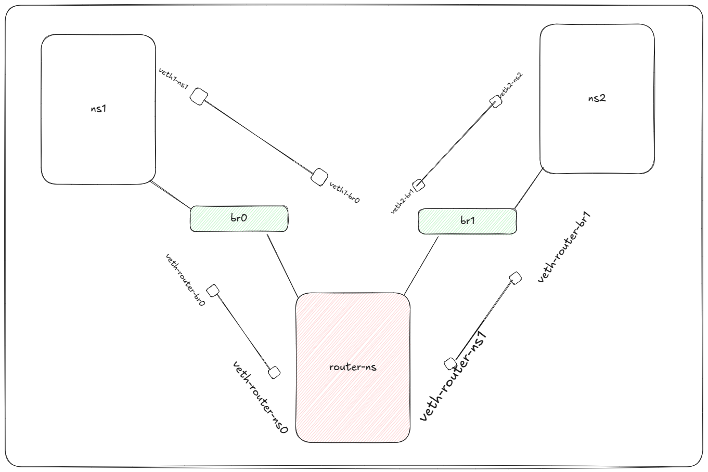

# Network Namespace Simulation



## Create the Namespaces and Bridges



```sh
sudo ip netns add ns1
sudo ip netns add ns2
sudo ip netns add router-ns
```

### Create Bridges

```sh
sudo ip link add br0 type bridge
sudo ip link add br1 type bridge
```

## Create veth Pairs



```sh
sudo ip link add veth1-ns1 type veth peer name veth1-br0
sudo ip link add veth1-ns2 type veth peer name veth1-br1
sudo ip link add veth-router-ns0 type veth peer name veth-router-br0
sudo ip link add veth-router-ns1 type veth peer name veth-router-br1
```

## Attach veth Interfaces to Their Namespaces



```sh
sudo ip link set veth1-ns1 netns ns1
sudo ip link set veth2-ns2 netns ns2
sudo ip link set veth-router-ns0 netns router-ns
sudo ip link set veth-router-ns1 netns router-ns
```

## Add veth Ends to Their Respective Bridges

```sh
sudo ip link set veth1-br0 master br0
sudo ip link set veth-router-br0 master br0
sudo ip link set veth2-br1 master br1
sudo ip link set veth-router-br1 master br1
```

## Assign IP Addresses and Bring Interfaces UP and Set the default route in the route table in the respective namespaces

### ns1

```sh
sudo ip netns exec ns1 ip addr add 192.168.1.2/24 dev veth1-ns1
sudo ip netns exec ns1 ip link set veth1-ns1 up
sudo ip netns exec ns1 ip route add default via 192.168.1.1
```

### Router

```sh
sudo ip netns exec router-ns ip addr add 192.168.1.1/24 dev veth-router-ns0
sudo ip netns exec router-ns ip addr add 192.168.2.1/24 dev veth-router-ns1
sudo ip netns exec router-ns ip link set veth-router-ns0 up
sudo ip netns exec router-ns ip link set veth-router-ns1 up
```

### Enable IP Forwarding on the Router

```sh
sudo ip netns exec router-ns sysctl -w net.ipv4.ip_forward=1
```

### ns2

```sh
sudo ip netns exec ns2 ip addr add 192.168.2.2/24 dev veth2-ns2
sudo ip netns exec ns2 ip link set veth2-ns2 up
sudo ip netns exec ns2 ip route add default via 192.168.2.1
```

## Bring Up the Bridges and veth Interfaces

```sh
sudo ip link set br0 up
sudo ip link set br1 up
sudo ip link set veth-router-br0 up
sudo ip link set veth-router-br1 up
```

## Test Packet Transfers

```sh
sudo ip netns exec ns1 ping 192.168.2.2
sudo ip netns exec ns2 ping 192.168.1.2
```
